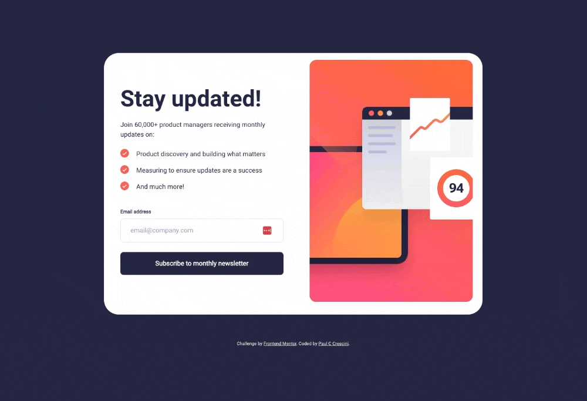
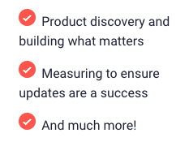

# Frontend Mentor - Newsletter sign-up form with success message solution

This is a solution to the [Newsletter sign-up form with success message challenge on Frontend Mentor](https://www.frontendmentor.io/challenges/newsletter-signup-form-with-success-message-3FC1AZbNrv). Frontend Mentor challenges help you improve your coding skills by building realistic projects.

## Table of contents

- [Overview](#overview)
  - [The challenge](#the-challenge)
  - [Screenshots](#screenshots)
  - [Links](#links)
- [My process](#my-process)
  - [Built with](#built-with)
  - [What I learned](#what-i-learned)
  - [Continued development](#continued-development)
  - [Useful resources](#useful-resources)
- [Author](#author)

## Overview

### The challenge

Users should be able to:

- Add their email and submit the form
- See a success message with their email after successfully submitting the form
- See form validation messages if:
  - The field is left empty
  - The email address is not formatted correctly
- View the optimal layout for the interface depending on their device's screen size
- See hover and focus states for all interactive elements on the page

### Screenshots

#### Desktop



#### Mobile


### Links

- Solution URL: [https://github.com/pcrescini/newsletter-sign-up-with-success-message](https://github.com/pcrescini/newsletter-sign-up-with-success-message)
- Live Site URL: [https://graceful-taffy-f610a2.netlify.app/](https://graceful-taffy-f610a2.netlify.app/)

## My process

### Built with

- Semantic HTML5 markup
- CSS custom properties
- Flexbox

### What I learned

No matter how much you think you know CSS, there is still plenty to learn! One the more challening CSS aspects of this project was using SVG files for the bullet points.

I first used the 'list-style-image' CSS property to display the custom bullet points.

```css
.content-container ul {
  list-style-image: url('/assets/images/icon-list.svg');
  list-style-position: inside;
}
```

However, I soon found out that when the text wraps to the next line, it will go directly underneath the bullet point.



Unfortunately, this won't do as it does not match the design specs:


Next, I decided to try to use the ::marker pseudo-element to style the list item elements. This seemed promising at first until I read that only certain CSS properties can be used in a rule with the ::marker selector (See [mdn web docs](https://developer.mozilla.org/en-US/docs/Web/CSS/::marker))

Finally, I resulted in the tried and true method of using the ::before pseudo-element to style the list item:

```css
.content-container ul li {
  list-style: none;
  margin-left: 2rem;
  margin-bottom: 0.75rem;
}

.content-container ul li::before {
  content: '';
  display: inline-block;
  width: 31px;
  height: 21px;
  background-image: url('/assets/images/icon-list.svg');
  background-repeat: no-repeat;
  background-size: contain;
  margin-right: 0.5rem;
  transform: translateY(15%);
}
```

### Continued development

Even though I've been working on bulding websites in some form or fashion for over 10 years, there is a lot left for me to learn. Like most things in life, if you don't use certain skills on repeated basis then you're most likely going to lose said skills. My continued development goal is to keep using my web development skills by building as many projects as I can.

### Useful resources

- [mdn webdocs](https://developer.mozilla.org/en-US/) - This website is my absolute go-to resource for all things web.

## Author

- Website - [paulcrescini.com](https://www.paulcrescini.com)
- Frontend Mentor - [@pcrescini](https://www.frontendmentor.io/profile/pcrescini)
- Twitter - [@paulccrescini](https://www.twitter.com/paulccrescini)
